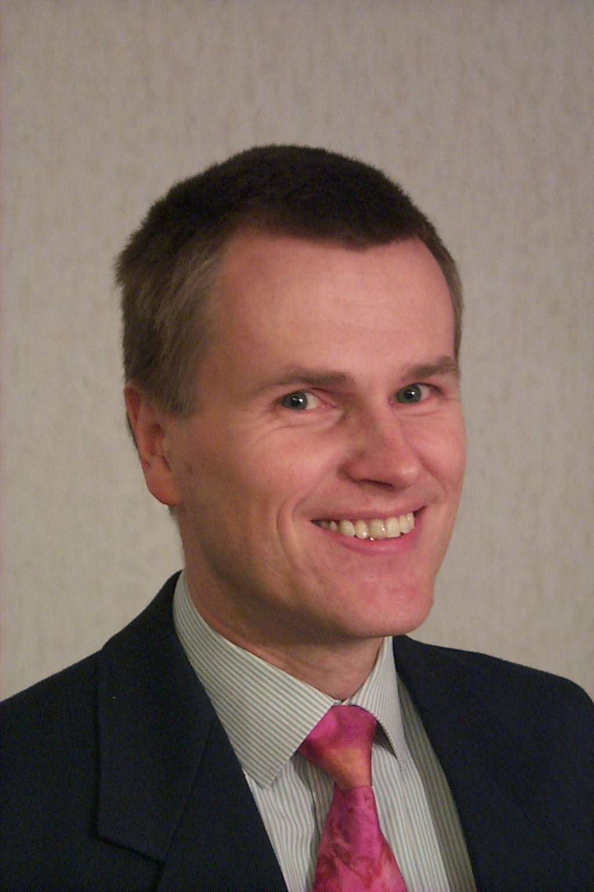

{:width="48px"}

Dr. Dirk Lellinger has been a senior scientist at the 
German Institute for Polymers,
which now is Division Plastics of the 
[Fraunhofer Institute for Structural Durability and System Reliability](https://www.lbf.fraunhofer.de/en.html) 
in Darmstadt, since 1995. His primary interests are ultrasonic spectroscopy, dynamic-mechanical spectroscopy, and the development of
measurement systems for laboratory automation and inline process control. He received his Diploma and a Ph.D. from the Technical University in Merseburg. From 1993 to 1995, he spent two years at the department of physics at the University of Halle.
