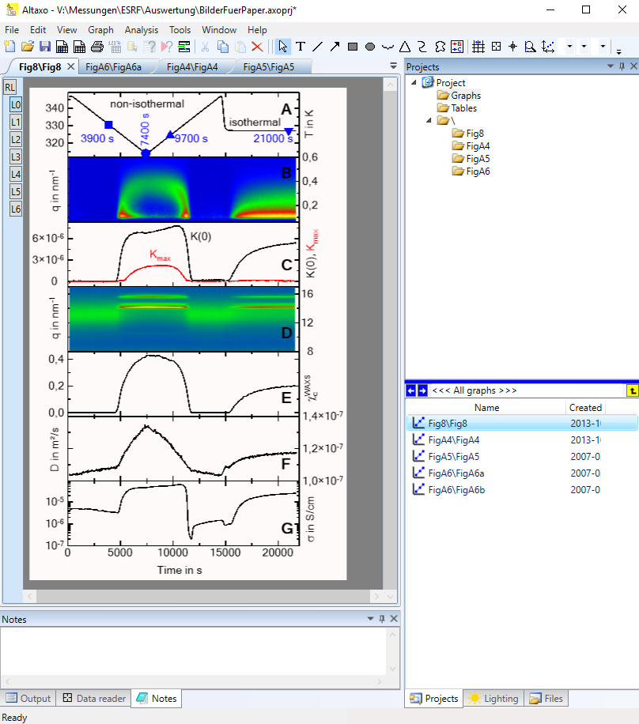
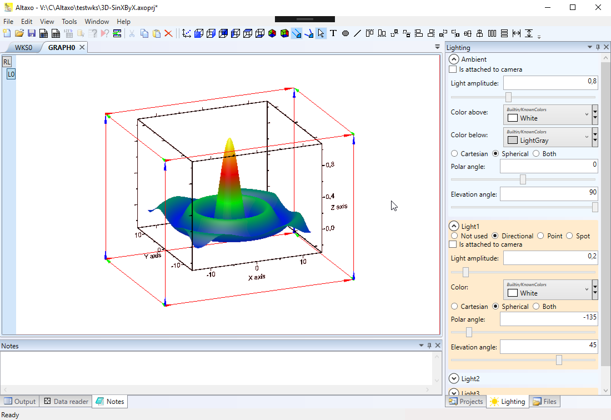
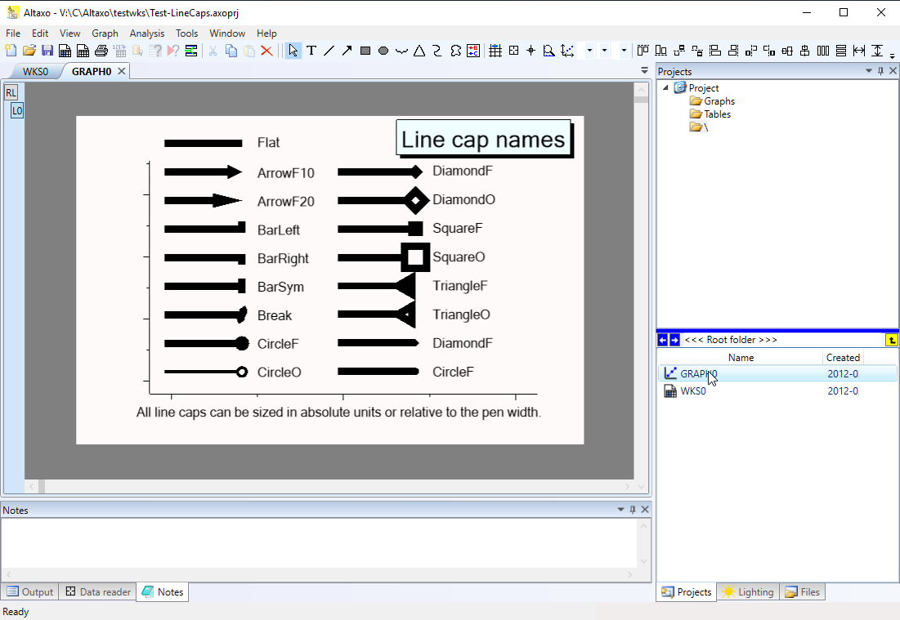
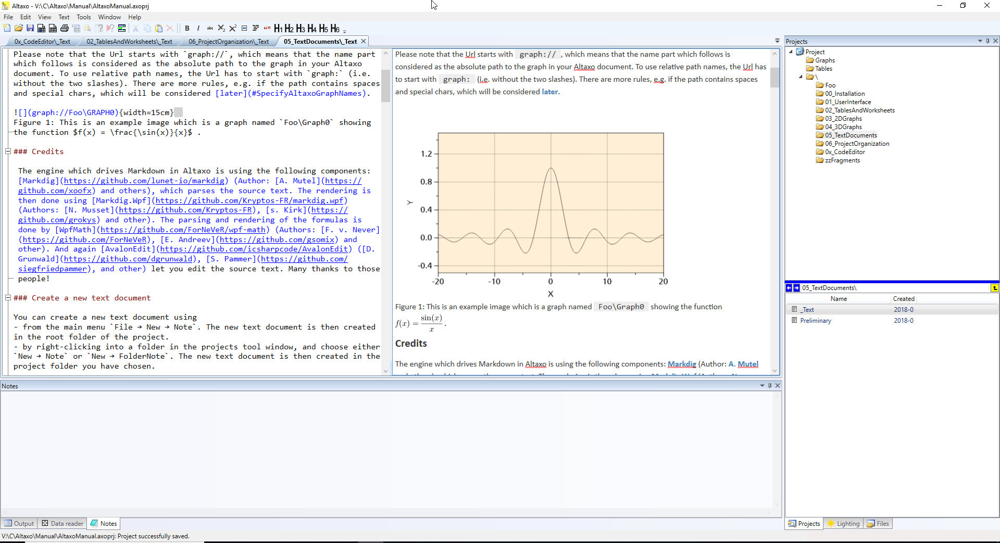
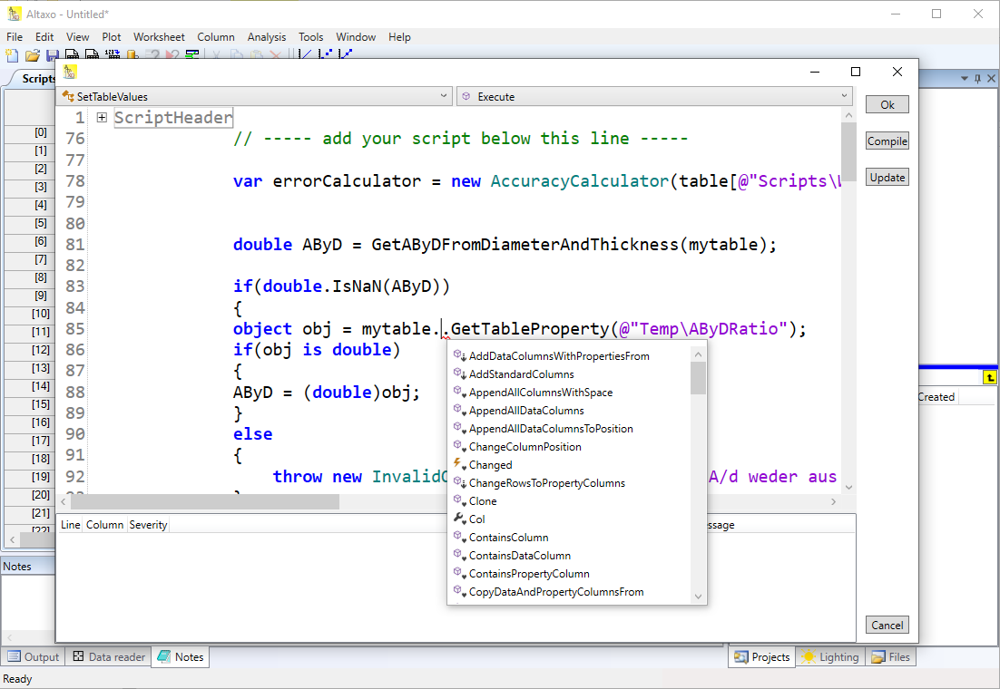

### 2D-Graph with 7 layers

{:width="600px"}

This is an example of a 2D graph consisting of 7 non-overlapping layers (L0..L6) as childs of the root layer RL.
Two of the layers show density plots, the other 5 layers measured curves.
The paper this figure is published in can be found [here](https://doi.org/10.1016/j.polymer.2014.02.069).

### 3D-Graph

{:width="600px"}

The classical example of a 3D graph. 3D graphs can be rotated and zoomed in real time.
All objects in this graph (including the text) are really 3D objects.
The lighting pane on the right side can be used to set the scene into the right light 
(with ambient, directional, point and spot lights of choosable colors). Each object in 
this graph is assigned a material, for which you can choose color, metallness and smothness.

### 2D-graphics: linecaps

{:width="600px"}

This is a small Altaxo project to demonstrate different line caps in a 2D graph.
The line caps can either have an absolute size or a size relative to the thickness of the line.

### Markdown text editor

{:width="800px"}

This screenshot shows the text editor of Altaxo in action. In fact, the Altaxo manual,
as shown here, is written using Altaxo itself! The content is then exported to Maml files
into a Sandcastle help file builder project and compiled to a help file, 
which is shipped with Altaxo and also available [online](https://altaxo.sourceforge.io/AltaxoClassRef/html/1B7FE024E7E614BFA13DAA1FD005CB2E.htm).

### Altaxo's code editor

{:width="600px"}

This screenshot shows Altaxo's script editor window, which is powered by the Roslyn C# compiler.
Semantic highlighting, code completion, folding and many other features are making script writing so much more easy.

